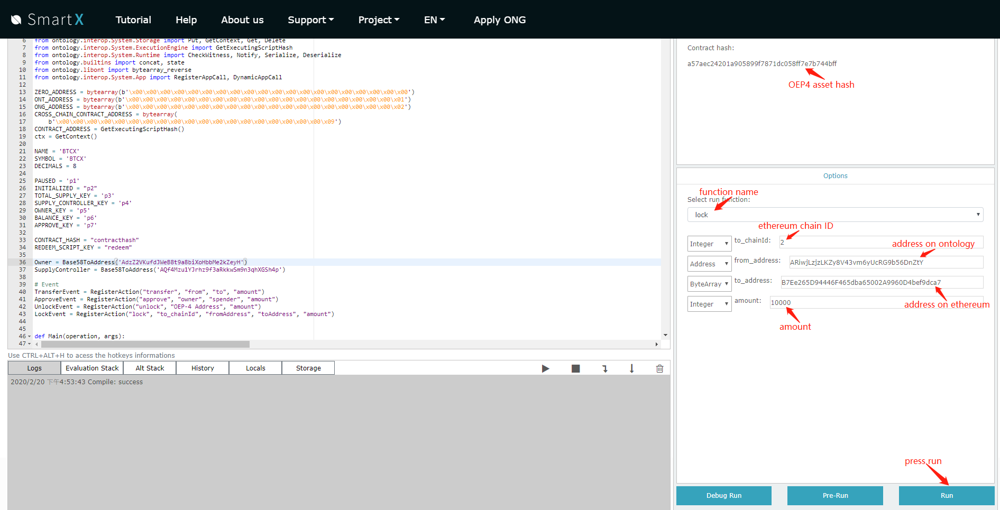
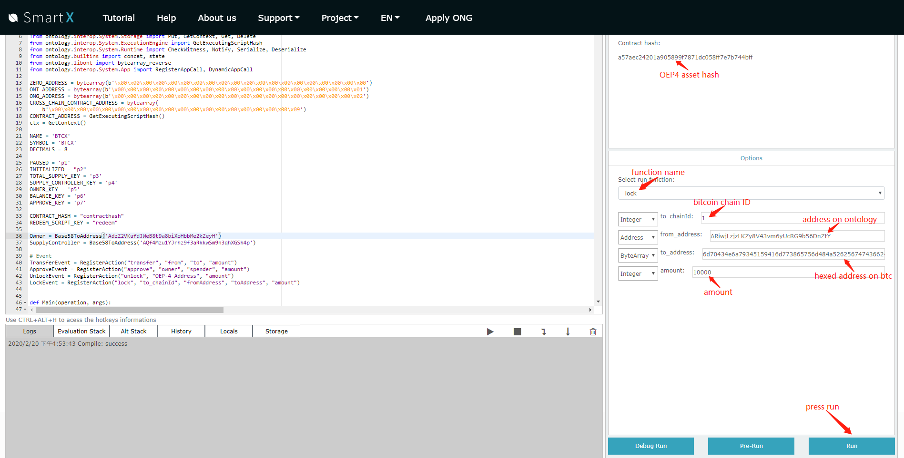
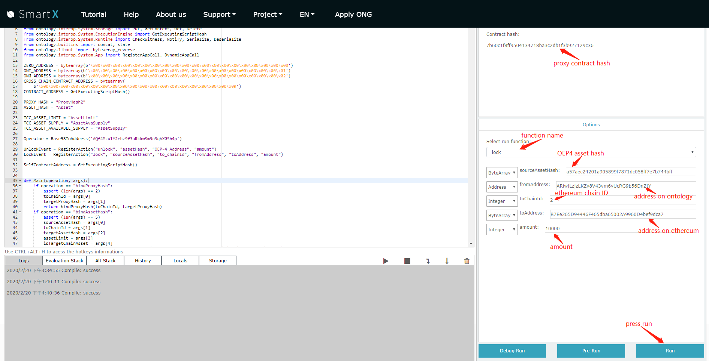
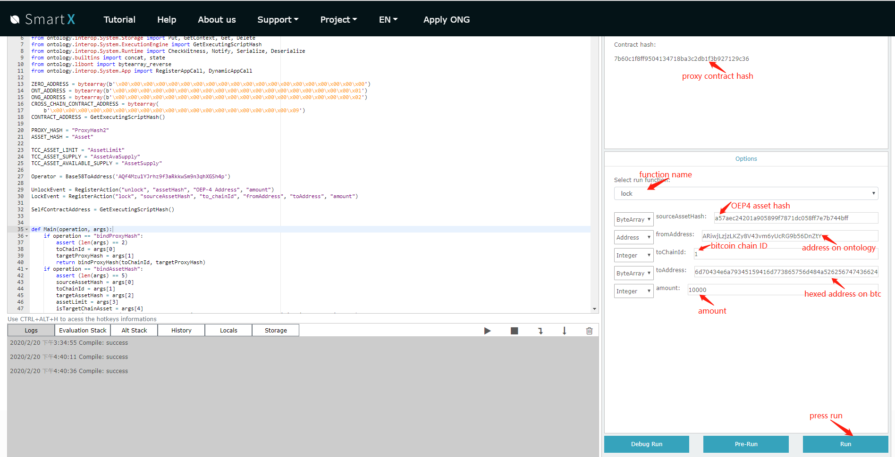

<h1 align=center> How to Transfer OEP4 Assets to Other Chains </h1>

English | [中文](./How_to_cross_OEP4_cn.md)

## Consolidating the corresponding contract addresses for the asset on different chains

Considering an arbitrary OEP4 asset as an example, its contract address on different chains would be:

- **Ontology chain:** `48fb861f8e6a857db7c977382d745113025a1c37`

- **Ethereum chain:** `0x4e52c69ee08dbf9a29b15abd64b175eaaedaa5be`

The BTC assets on the Ontology chain have the following contract addresses:

- **Ontology chain:** `a57aec24201a905899f7871dc058ff7e7b744bff`

- **Ethereum chain:** `0xffa9cc8aa69fff09d6180dbca187a672a0402b1d`

- **BTC chain:** `c330431496364497d7257839737b5e4596f5ac06`

Since Bitcoin doesn't support smart contracts, the BTC contract addresses stated above are exactly contract addresses. The Bitcoin network employs multi-signature addresses to which the user transfers their assets which are then locked. Thus, in the context of Bitcoin, the term "contract address" refers to the hash of the multi-signature address.

## OEP4 assets with cross chain features

If a certain asset integrates features such as `lock` and `unlock` interface methods, cross chain transactions transactions can be carried out by invoking the `lock` method. This can be done using the SmartX IDE as follows: 

The above pictures illustrate how assets can be transferred to the Ethereum and Bitcoin networks.

## OEP4 assets without cross chain features

If an OEP4 asset does not natively integrate the `lock` and `unlock` methods, then its corresponding proxy contract's `lock` and `unlock` interface methods are invoked when carrying out cross chain transfers. Also, the user needs to `approve` the proxy contract for a certain amount before carrying out cross chain transactions.

The above pictures illustrate how assets can be transferred to the Ethereum and Bitcoin networks.